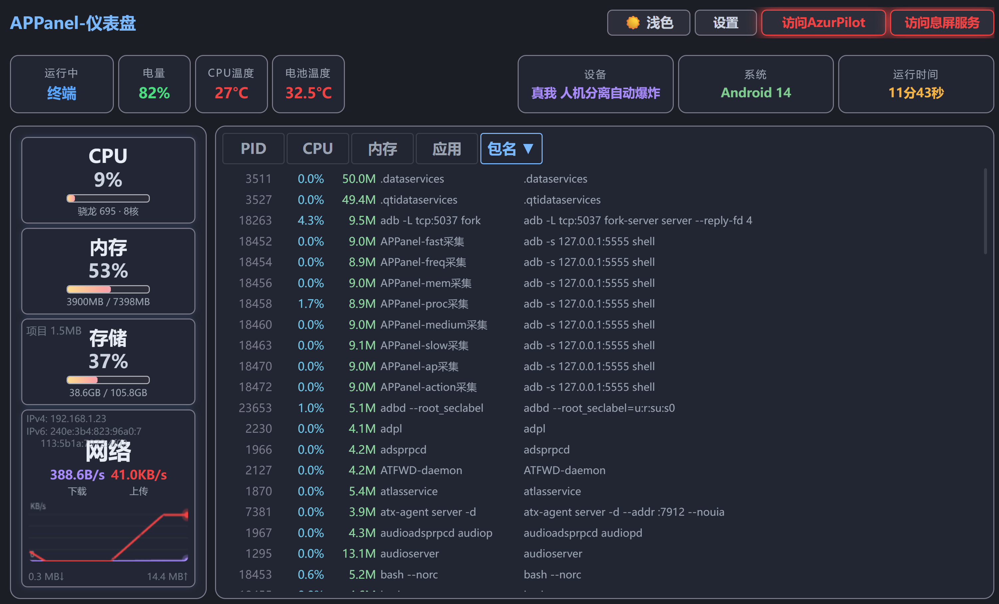

# APPanel — Android 设备实时监控仪表盘

[GitHub](https://github.com/YuCould/APPanel) | [English](README_EN.md) | 运行在 **Termux** 中，通过 **Web 页面**实时展示 Android 设备状态。集成了 ADB 无线调试、多通道持久 Shell、Diff 推送 WebSocket，无需 root 即可实现 CPU/内存/存储/网络/电池/进程等全方位监控。
 
### 核心特性

- 🖥️ **Web 仪表盘** — Flask + WebSocket 实时推送，桌面/移动端自适应布局
- 📊 **多维度监控** — CPU 占用、内存、存储、网络速率/总流量、电池电量/温度、进程列表
- 🔌 **ADB 无线调试** — 8 通道持久 ADB Shell 并行采集，互不阻塞
- ⚡ **高温保护** — 电池≥50°C 持续 15 分钟后自动杀 AP 后端和碧蓝航线进程（⚠️ 未实测）
- 🔧 **可视化设置** — Web 页面管理芯片映射、应用名映射、采集速度、隐藏进程、自启动开关、端口配置
- 🔄 **手动更新** — 版本检测对比，手动点击 `git pull` 并自动重启
- 🛡️ **自启动守护** — SSH/仪表盘/AP后端/高温杀进程/固定ADB端口，页面开关即配置
- 📱 **进程管理** — 进程列表排序、过滤、KILL 终止，设置页独立操作界面



## 功能

### 仪表盘
- **CPU**：实时占用率（多核合计），带动态渐变进度条，右上角显示活跃核心数
- **内存**：已用/总量显示，百分比进度条
- **存储**：已用/总量显示，自动 GB/MB 单位，附带项目目录大小
- **网络**：实时下载/上传速率（1位小数），Canvas 60fps 贝塞尔曲线图表，180 个采样点；IPv4 + IPv6 地址，累计下载/上传总量（默认 MB，超 1GB 自动切换）
- **电池**：电量百分比（数字动画过渡），电池温度（>40°C 预警，≥50°C 持续 15 分钟后杀 AP 和碧蓝航线，⚠️ 未实测）
- **CPU 温度**：从 thermal_zone 读取，>70°C 显示脱焊风险警告
- **设备信息**：制造商 + 型号（仅首次采集）
- **系统版本**：Android API 版本
- **运行时间**：基于服务端启动时间戳本地自动计算

### 进程管理
- 实时进程列表，默认按 CPU 降序排列，最多显示 100 个进程
- 支持按 PID / CPU / 内存 / 应用 / 包名 正序/倒序排序
- **点击任意进程行复制包名**到剪贴板
- 自动标记：APPanel-主进程、APPanel-fast采集、APPanel-freq采集、APPanel-mem采集、APPanel-proc采集、APPanel-medium采集、APPanel-slow采集、APPanel-ap采集、APPanel-action采集、APPanel-adb、APPanel-ps、APPanel-AP后端、APPanel-通道名-shell 等
- 隐藏进程前缀设置（如 android.），支持自定义

### 设置编辑器
- 可视化 settings.json 编辑器，支持分类管理：
  - **芯片**：处理器代号 → 显示名称
  - **应用**：包名 → 应用名称
  - **自启动**：可视化开关，管理开机自启项，自动写入 ~/.bashrc
  - **采集速度**：每条通道独立调节（0.25x~4x）
  - **隐藏进程**：按前缀过滤进程列表
- 内联编辑、新增条目、一键删除
- **📱 当前前台按钮**：快速将当前前台 APP 添加到映射
- JSON 格式校验，保存后自动重载

### 设置页附加功能
- **Kill-进程**：独立进程管理页面，搜索过滤 + KILL 按钮（支持 am force-stop 和 kill），默认 CPU 降序排列
- **版本信息**：显示本地 git commit hash 和时间，同时查询远程仓库最新版本，手动触发更新
- **端口配置**：可自定义 Flask/WebSocket/AP(ALAS)/ADB/熄屏服务端口，保存后重启生效
- **重启**：一键重启 APPanel + 关闭 proot-distro ubuntu

### 其他特性
- **WebSocket Diff 推送**：仅推送变化的数据字段，每 10 次循环做一次全量同步保证可靠性
- **render 防抖**：连续 WS 消息 50ms 内只执行一次渲染
- **进程表 HTML 缓存**：ps_raw 未变化时不重建 DOM
- ~~**实时采集频率显示**~~：因频率计算不准确且占用性能，已移除
- **标题点击可自定义修改**
- **温度悬浮警告**：CPU 温度 >70°C / 电池温度 >40°C hover 显示预警卡片
- **深色/浅色主题切换**，无需刷新

---

## 部署到新设备

### 前置条件

1. **Termux** 安装（F-Droid 版）
2. **安装必要软件包**（下载慢可先执行 `termux-change-repo` 选择国内镜像源）：
   ```bash
   pkg update && pkg upgrade -y
   pkg install python android-tools openssh git -y
   pip install flask websockets
   ```
3. **ADB 无线调试**：
   - 手机开启「开发者选项」→「无线调试」
   - 使用「配对码配对」，在 Termux 中执行：
     ```bash
     adb pair 127.0.0.1:配对端口
     adb connect 127.0.0.1:连接端口
     adb devices
     ```

### 安装

```bash
git clone https://github.com/YuCould/APPanel.git ~/APPanel
cd ~/APPanel
python dashboard.py
```

启动后访问 `http://手机IP:20080`。

### 自启动

<small>需 root，否则重启后需 Termux 重新配对。</small>

设置页 → 自启动 → 打开开关 → 保存，自动写入 `~/.bashrc`。

### AP 后端

配合 [AzurPilot](https://github.com/wess09/AzurPilot)（碧蓝航线自动化后端），部署到 proot-distro ubuntu 内。设置页 → 自启动 → 开启 **AP 后端** 即可。

### 熄屏服务

配合 [ScreenOff](https://github.com/WuDi-ZhanShen/ScreenOff)（克隆版 [YuCould/ScreenOff-APPanel](https://github.com/YuCould/ScreenOff-APPanel)）可实现一键熄屏挂机（OLED 像素完全关闭，APP 保持运行不锁频）。需 [Shizuku](https://shizuku.rikka.app/) 权限。端口默认 20000，可在设置页修改。

---

## 架构

### 8 通道持久 ADB Shell

每个通道拥有独立的 ADB shell + 本地 bash --norc 进程 + threading.Lock，互不阻塞。前端进程列表会为每个通道的 ADB shell 标记 `APPanel-通道名-采集`，本地 bash 标记 `APPanel-通道名-shell`：

| 通道 | 采集项 | 基础间隔 | 速度倍率跟随 |
|------|--------|---------|-------------|
| `fast` | CPU jiffies + 网络字节数 + AP 进程资源 | 2s | fast |
| `freq` | CPU 核心频率 | 2s | fast |
| `mem` | 内存 (/proc/meminfo) | 2s | fast |
| `proc` | 进程列表 (ps -e) | 2s | fast |
| `medium` | 电池 + 前台应用 + CPU 温度 | 10s | medium |
| `slow` | 存储 (df) | 30s | slow |
| `ap` | AP 端口检测 + IP + 运行时间 + 型号识别 | 10~60s | slow |
| `action` | KILL 进程等操作 | 按需 | - |

### 数据流

```
采集器线程 → _sd(共享字典) → 广播线程(0.5s) → diff → WebSocket → 前端 Object.assign → render(50ms防抖)
```

- 广播线程每 0.5s 将 `_sd` 同步到 `CACHE`，计算 diff，仅推送变化字段
- 每 10 次循环做一次全量推送保证可靠性
- 前端 `Object.assign` 增量合并，`render()` 带有 50ms 防抖
- 进程列表 HTML 缓存：`ps_raw` 未变化时不重建 DOM，减少重绘

### 采集方式

所有数据通过 **8 通道持久 ADB/Local Shell** 采集，每个通道有独立进程+锁：

| 数据 | 通道 | 命令 | 间隔 |
|------|------|------|------|
| CPU 占用率 | `fast` ADB | `cat /proc/stat` → jiffies 差值 | 2s |
| 网络流量 | `fast` ADB | `cat /proc/net/dev` 解析 `wlan0` | 2s |
| CPU 频率 | `freq` ADB | 本地 sysfs `scaling_cur_freq` | 2s |
| CPU 型号 | `ap` 本地 | `getprop ro.board.platform` | 60s |
| 内存 | `mem` ADB | `cat /proc/meminfo` | 2s |
| 存储 | `slow` 本地 | `df /data` | 30s |
| 电池+前台 | `medium` ADB | `dumpsys battery` + `dumpsys window` | 10s |
| CPU 温度 | `medium` 本地 | `/sys/class/thermal/thermal_zone*/temp` | 10s |
| 进程列表 | `proc` ADB | `ps -e -o pid,pcpu,rss,args` | 2s |
| AP 进程 | `fast` 本地 | `ps \| grep gui.py` | 2s |
| AP 存活+IP | `ap` ADB | TCP 检测 + `ip addr show wlan0` | 10s |

### 性能

- **CPU**：取决于处理器性能，配置越高占用越低。快速采集（CPU+网络+频率+内存+进程+AP进程）约 5%~20% 单核，其他通道均 <1%
- **内存**：主进程约 30MB + 8 个持久 ADB Shell 共约 64MB（8MB/个） + 8 个本地 bash --norc 共约 32MB（4MB/个）
- **网络**：单客户端每轮推送约 30KB（ps_raw 占 85%），diff 推送时仅变化字段约数百字节

---

## 文件说明

| 文件 | 说明 |
|:----|:-----|
| `dashboard.py` | 入口文件 |
| `server.py` | Flask + WebSocket 服务 |
| `page.html` | 前端单页应用（CSS+JS 内联） |
| `settings.json` | 芯片/应用/自启动/采集速度/隐藏进程配置 |
| `config.py` | 端口和地址配置 |
| `collectors/adb_shell.py` | 8 通道持久 ADB/Local Shell 管理 |
| `collectors/base.py` | 采集器基础工具（通道 wrapper、线程启动） |
| `collectors/runner.py` | 采集器启动器，分配通道和间隔 |
| `collectors/broadcast.py` | Diff 广播线程 |
| `collectors/hot_protect.py` | 高温保护（电池≥50°C持续15分钟杀进程） |
| `collectors/fast_bundle.py` | CPU + 网络 + AP 进程采集 |
| `collectors/cpu.py` | CPU 频率 + 型号采集 |
| `collectors/memory.py` | 内存采集 |
| `collectors/processes.py` | 进程列表采集 |
| `collectors/battery.py` | 电池 + 前台应用采集 |
| `collectors/temperature.py` | CPU 温度采集 |
| `collectors/storage.py` | 存储采集 |
| `collectors/ap_ip.py` | AP 检测 + IP + 运行时间采集 |
| `collectors/ws.py` | WebSocket 客户端管理 |
| `collectors/shared.py` | 共享状态（_sd、_CPU_MAP、锁） |
| `routes/misc.py` | 杂项路由（首页、API、重启、版本、kill-ubuntu） |
| `routes/config_routes.py` | 设置 API + 自启动 .bashrc 生成 |
| `startup.sh` | 手动启动脚本（sshd + APPanel） |
| `start_ap.sh` | AP 后端启动脚本（proot-distro ubuntu） |

## settings.json 配置

`settings.json` 存储芯片映射、应用名称映射、自启动、采集速度、隐藏进程等配置，可通过页面 **设置** 按钮可视化编辑。

### 结构

```json
{
  "chips": { "kona": "骁龙 865" },
  "packages": { "com.tencent.mm": "微信" },
  "autostart": { "sshd": true, "dashboard": true, "ap_backend": false, "hot_protect": true, "fix_adb_port": false },
  "collect_speeds": { "fast": 1.0, "medium": 1.0, "slow": 1.0 },
  "hidden_procs": { "android.": "" }
}
```
